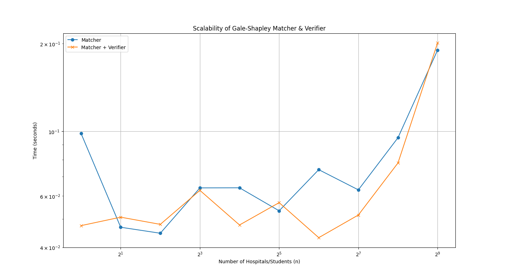

# Algorithms-Assignment1: Stable Matching

## Student Info
* **Name:** Adi Chauhan (UFID: 78721054)
* **Name:** Peyton Hecht (UFID: 99580280)

## Structure
* `src/matcher.py`: The Gale-Shapley implementation. Reads from stdin.
* `src/verifier.py`: The validation script. Reads input file from arg and matching from stdin.
* `data/`: Contains example input files.
* `tests/`: Contains test files.

## Instructions

### 1. Run the Matcher (Task A)
The matcher reads preference data from standard input (stdin).
```bash
# Run with an example file(1 or 2)
python src/matcher.py < data/example1.in
```
### 2. Run the Verifier (Task B)
The verifier reads the matcher output from the pipe and validates it
```bash
python src/matcher.py < data/example1.in | python src/verifier.py data/example1.in
```

### 3. Task C Solution
To measure how our matcher and verifier scale with increasing problem size, we ran the matching algorithm and verifier on randomly generated inputs with the number of hospitals/students n = 1, 2, 4, 8, 16, 32, 64, 128, 256, 512. The blue line shows the matcher only, while the orange line shows matcher + verifier. The trend shows that both had a runtime complexity of O(n^2), this is because when n doubles, the runtime quadruples. This is as expected because there are n x n participants in the stable matching scenario. 

How to reproduce: 
```bash
python experiments\partC.py
```